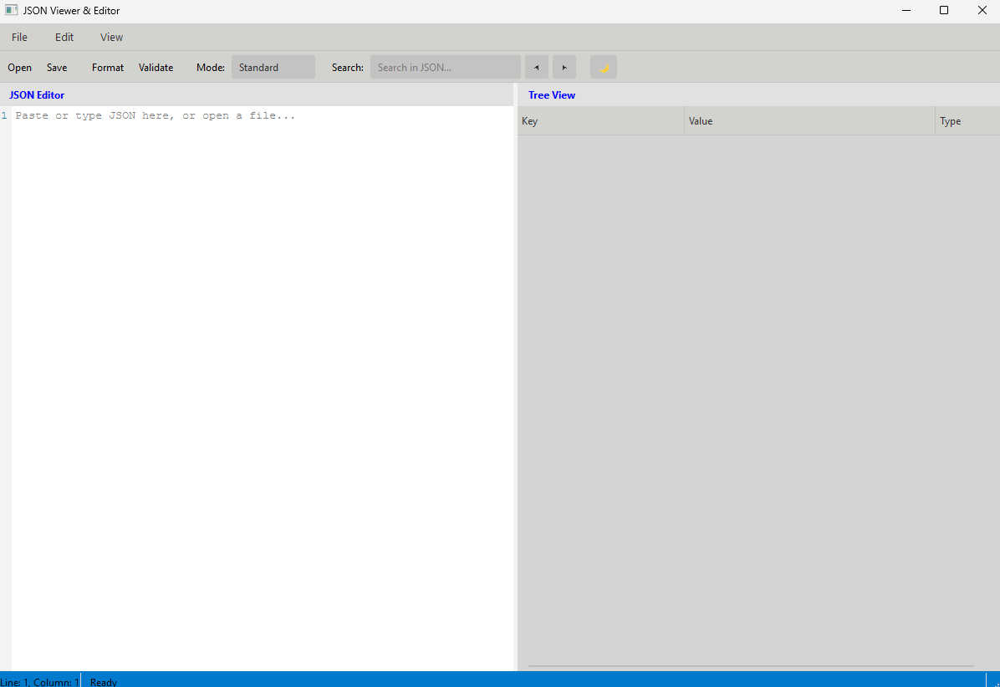
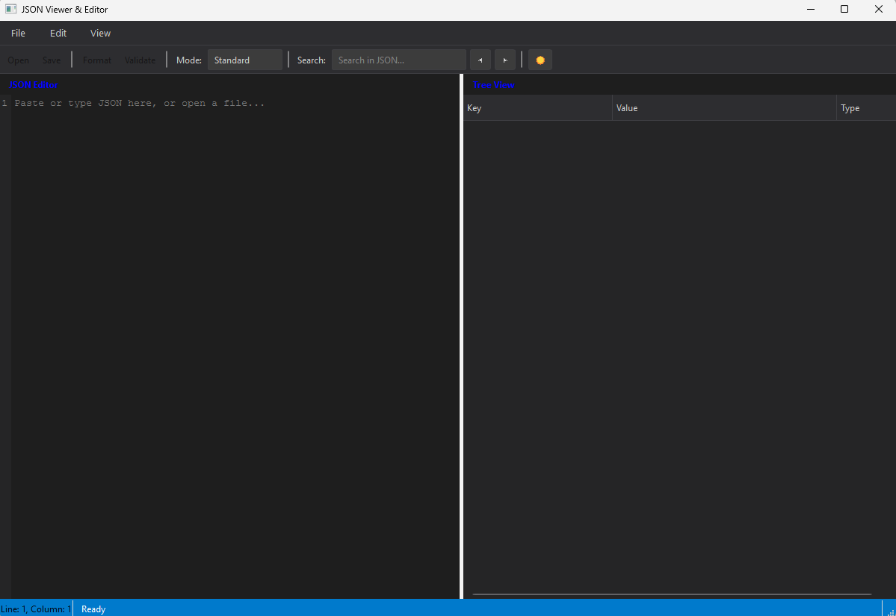
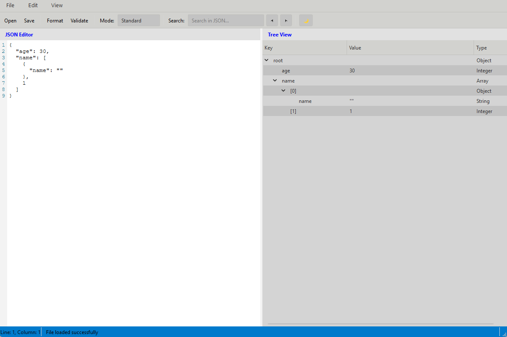
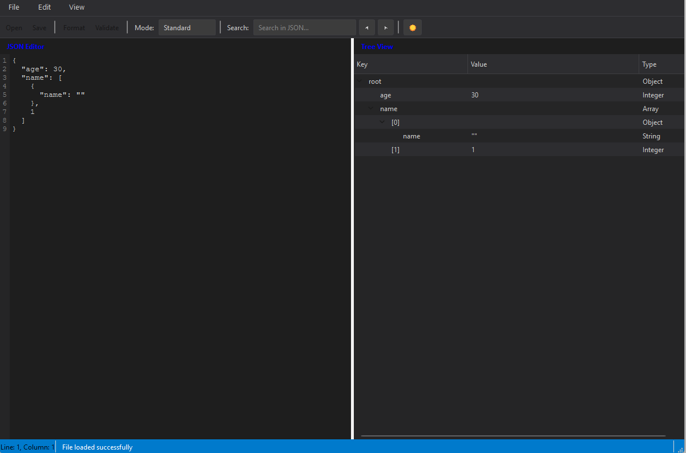

# JSON Viewer & Editor

A cross-platform desktop application for viewing, editing, formatting, and validating JSON files — built with **C++17** and **Qt 6**.

The project was developed as a study in applying classical software design patterns to a real GUI application. Every architectural decision maps to a named pattern, described in the [Architecture](#architecture--design-patterns) section below.

---

## Screenshots

| Light Mode | Dark Mode |
|:---:|:---:|
|  |  |

| File Loaded — Light | File Loaded — Dark |
|:---:|:---:|
|  |  |

---

## Features

- **Split-pane interface** — monospaced code editor on the left, interactive tree view on the right; resizable splitter between them
- **Line-number gutter** — always-visible line and column indicator in the status bar
- **Three parse modes** selectable from the toolbar:
  - `Standard` — strict RFC 8259 JSON
  - `Strict` — additionally rejects duplicate keys and leading zeros
  - `Relaxed` — accepts `//` and `/* */` comments and single-quoted strings, and preserves comments on save
- **Comment preservation** — in Relaxed mode, comments are round-tripped through load → edit → save using path-keyed storage
- **Auto-format** — pretty-prints the current document with consistent indentation
- **Validation** — structural validation with optional schema constraints (min/max, string length, array size, required fields)
- **Search with navigation** — highlights all matches simultaneously; ◀ ▶ buttons and `F3` / `Shift+F3` cycle through results; active match shown in a distinct colour
- **Dark / light theme** — toggled with the 🌙/☀️ button or `Ctrl+T`; all widgets re-styled instantly
- **Unsaved-changes guard** — prompts to save on close or when opening a new file

---

## Keyboard Shortcuts

| Action | Shortcut |
|---|---|
| Open file | `Ctrl+O` |
| Save | `Ctrl+S` |
| Save As | `Ctrl+Shift+S` |
| Format JSON | `Ctrl+F` |
| Validate JSON | `Ctrl+E` |
| Find | `Ctrl+F` (focus search bar) |
| Find Next | `F3` |
| Find Previous | `Shift+F3` |
| Toggle theme | `Ctrl+T` |
| Quit | `Ctrl+Q` |

---

## Build Requirements

| Requirement | Version |
|---|---|
| Qt | 6.6 or later |
| C++ standard | C++17 |
| Compiler | MinGW 64-bit, MSVC 2019+, or GCC 11+ |
| Build system | qmake (Qt Creator) or CMake 3.16+ |

---

## Building

### Qt Creator (recommended)

1. Clone the repository:
   ```bash
   git clone https://github.com/your-username/JSONViewer.git
   ```
2. Open Qt Creator → **File → Open File or Project** → select `JSONViewer.pro`
3. Select a kit (Desktop Qt 6.x MinGW 64-bit or equivalent)
4. Press **Ctrl+B** to build
5. Press **Ctrl+R** to run

### Command line (qmake)

```bash
git clone https://github.com/your-username/JSONViewer.git
cd JSONViewer
mkdir build && cd build
qmake ..
make -j$(nproc)
./JSONViewer
```

---

## Architecture & Design Patterns

The codebase is structured around the **MVC** architectural pattern with several classical GoF patterns applied at the component level. Every pattern below has a direct, non-trivial implementation in the source — not just a mention in a comment.

---

### MVC — Model / View / Controller

```
┌─────────────────────────────────────────────────────────┐
│                        MainWindow                        │  View
│   (coordinator — owns no business logic of its own)      │
│                                                          │
│   SearchController   TreeViewController   ThemeManager   │
└───────────────┬─────────────────────────────────────────┘
                │ calls
┌───────────────▼──────────────────┐
│          JSONController          │  Controller
│  openFile · saveFile · parseText │
│  formatJSON · validateJSON       │
└───────────────┬──────────────────┘
                │ owns
┌───────────────▼──────────────────┐
│            JSONModel             │  Model
│  document · commentStore         │
│  currentFilePath · warnings      │
└──────────────────────────────────┘
```

`MainWindow` never touches `JSONModel` directly. It speaks only to `JSONController`, which translates UI intent into model operations and returns structured `OperationResult` objects — never raw strings.

---

### Factory — `JSONParserFactory`

```cpp
// Callers depend only on IJSONParser, never on a concrete parser class.
auto parser = JSONParserFactory::createFromFile(path, ParserType::RELAXED);
auto doc    = parser->parse();
```

`JSONParserFactory` is the single place where `ParseMode` maps to a concrete `JSONParser`. Adding a new mode (e.g. `JSONC`, `JSON5`) requires changing only the factory and the enum — zero changes to callers.

---

### Strategy — Parse Modes

`IJSONParser` is the strategy interface. The three parse modes (`STANDARD`, `STRICT_MODE`, `RELAXED`) are runtime-selectable strategies passed through the factory. The UI combo box switches strategies without the parser internals leaking into the view layer.

---

### Builder — `JSONValueBuilder`

Constructs arbitrarily nested `JSONValue` trees through a fluent scope-stack API:

```cpp
auto value = JSONValueBuilder{}
    .startObject()
        .addProperty("name", "Alice")
        .startArray("scores")
            .addElement(95)
            .addElement(87)
        .endArray()
    .endObject()
    .build();
```

The internal scope stack tracks open objects and arrays so nesting can go to any depth. `endObject()` / `endArray()` automatically wire the finished node into its parent.

---

### Composite — `JSONValue`

`JSONValue` holds a `std::variant<NullType, int, float, bool, std::string, JSONObject, JSONArray>`. Objects and arrays recursively contain `shared_ptr<JSONValue>` children, making the entire document a Composite tree. Uniform operations (`print`, `size`, `operator[]`) work identically on leaves and branches.

---

### Structured Error Handling — `OperationResult` / `ParseError`

All controller methods return `OperationResult` instead of `(bool, string&)` out-parameters:

```cpp
auto result = controller->openFile(path, parserType);
if (!result) {
    // result.error.line and result.error.column are typed ints
    // No regex needed in the view layer
    showError(result.error.line, result.error.column, result.message);
}
```

`ParseError::fromException()` parses location information from tokenizer exceptions once, centrally, so the view never needs to regex-parse error strings.

---

### Single Responsibility — UI Sub-controllers

`MainWindow` delegates to three focused sub-controllers rather than implementing their logic itself:

| Class | Responsibility |
|---|---|
| `SearchController` | Match finding, highlight painting, result navigation, wrap-around |
| `TreeViewController` | Tree population from a `JSONValue` root, type display, click signals |
| `ThemeManager` | Dark/light stylesheet strings, theme state, `CodeEditor` re-theming |

Each sub-controller is a `QObject` that communicates with `MainWindow` through Qt signals, keeping coupling minimal.

---

### Comment Preservation — `CommentStore`

Comments are stored externally to `JSONValue` in a path-keyed map:

```
"root.users[0].name"  →  [ Comment("// primary contact", LINE, trailing) ]
```

This keeps `JSONValue` as a pure data node. The tokenizer captures comments during lexing; the parser associates them with their JSON path; `JSONValueIO` re-emits them in the correct position on serialisation.

---

## File Structure
```
JSONViewer/
├── main.cpp
├── .gitignore
│
├── core/
│   ├── Value.h
│   ├── Value.cpp
│   ├── ValueBuilder.h
│   ├── ValueBuilder.cpp
│   └── CommentPreservation.h
│
├── parser/
│   ├── Parser.h
│   ├── Parser.cpp
│   ├── ParserFactory.h
│   ├── ParserFactory.cpp
│   ├── Tokenizer.h
│   ├── Tokenizer.cpp
│   └── JSONValueIO.h
│
├── model/
│   ├── JSONModel.h
│   ├── JSONModel.cpp
│   ├── JSONController.h
│   ├── JSONController.cpp
│   ├── JSONSchema.h
│   ├── JSONSchema.cpp
│   └── ParseResult.h
│
├── ui/
│   ├── mainwindow.h
│   ├── mainwindow.cpp
│   ├── SearchController.h
│   ├── SearchController.cpp
│   ├── TreeViewController.h
│   ├── TreeViewController.cpp
│   ├── ThemeManager.h
│   └── ThemeManager.cpp
│
└── docs/
    └── screenshots/
```

---

## Known Limitations

- **No inline editing** — values cannot be edited directly in the tree view; all edits go through the text editor pane.
- **Integer overflow** — numbers are parsed as `int` / `float`; very large integers or high-precision decimals will lose precision.
- **Single-file schema** — `JSONSchema` only validates flat objects (one level of fields). Nested schema constraints are not yet supported.
- **No undo/redo** — the text editor relies on Qt's built-in undo stack, which is not integrated with the parse/format cycle.
- **Windows only tested** — built and tested on Windows 10/11 with MinGW 64-bit. Linux and macOS should work (Qt is cross-platform) but are untested.

---

## Roadmap

- [ ] Inline value editing in the tree view
- [ ] Nested schema validation (recursive `JSONSchema` nodes)
- [ ] Syntax highlighting in the editor (keywords, strings, numbers in distinct colours)
- [ ] `int64_t` and `double` support to replace `int` / `float`
- [ ] Find-and-replace in the editor
- [ ] JSON-to-CSV and JSON-to-XML export
- [ ] Linux & macOS CI via GitHub Actions
